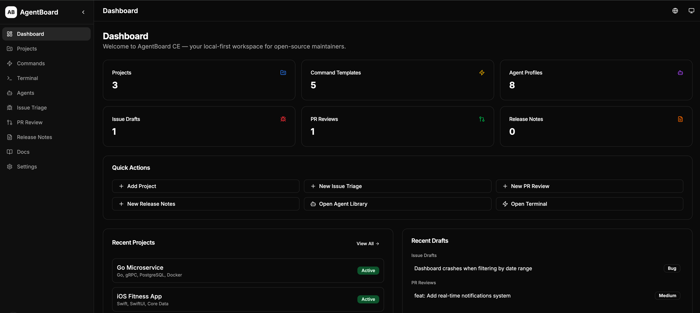
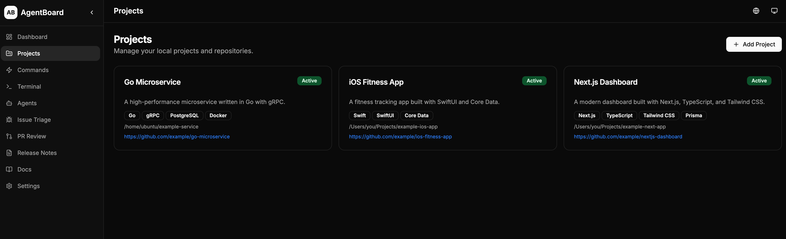
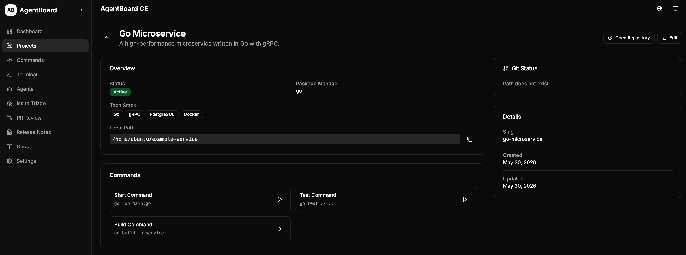
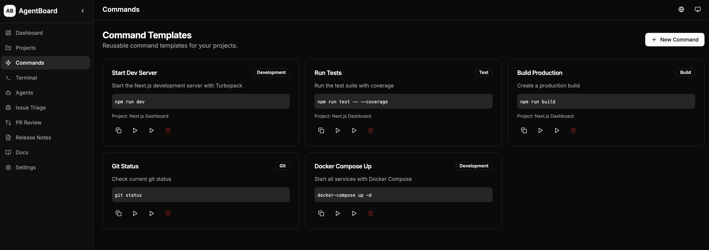
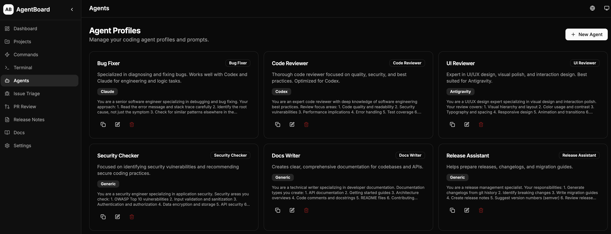
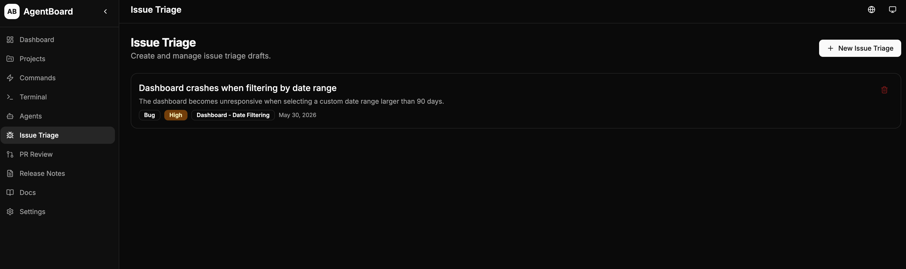
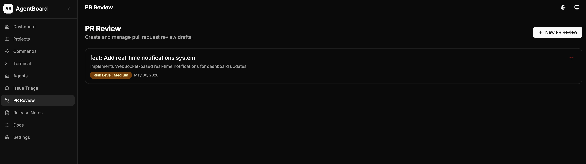
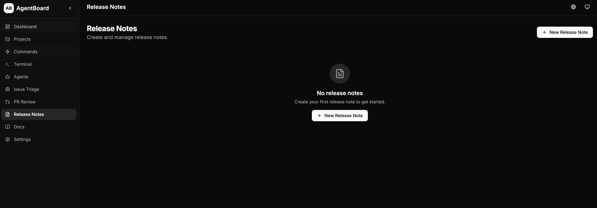
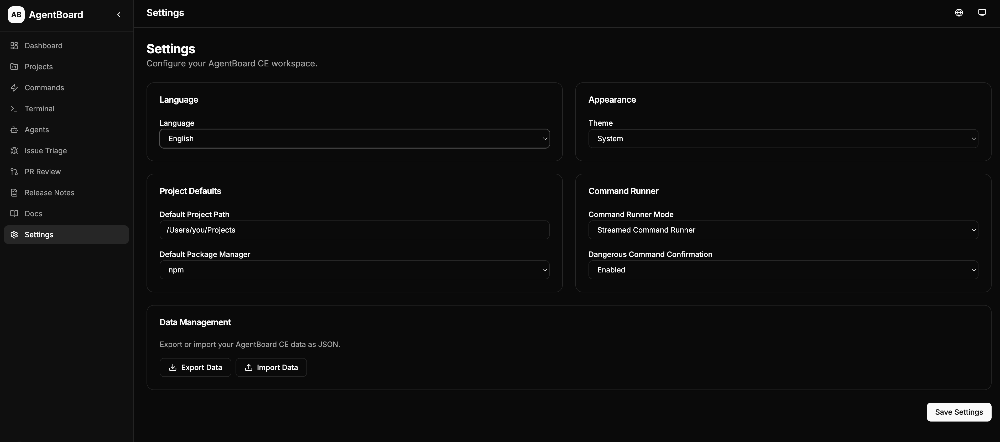

# AgentBoard CE

**Local-first workspace for open-source maintainers and coding agents.**

AgentBoard CE helps developers and open-source maintainers manage local projects, command templates, coding agent prompts, issue triage, pull request review, release notes, and documentation workflows from one dashboard.

## Why AgentBoard CE?

Open-source maintainers juggle multiple tools daily — terminal, issue trackers, code review, release notes, documentation. AgentBoard CE brings these workflows together in a single local-first application:

- **Local-First**: All data stored in SQLite on your machine. No cloud services, no external API keys required, no telemetry.
- **Developer-Focused**: Clean UI with dark mode, keyboard-friendly navigation, and responsive design.
- **Agent-Ready**: Pre-configured profiles for popular coding agents like Codex, Claude, and Cursor.
- **Workflow Automation**: Streamline issue triage, PR reviews, and release note generation.

## Features

### Dashboard
- Overview of all projects, commands, agents, and drafts
- Quick actions for common tasks
- Recent activity feed

### Project Registry
- Manage local projects and repositories
- Track tech stack, package managers, and commands
- Git integration for branch and status information
- Quick access to start, test, and build commands

### Git Repository Insights
- Local branch and working tree status (clean/dirty)
- Remote origin URL display
- Modified, staged, and untracked file lists
- Recent commits overview with hash, message, author, and date
- Copy Git Summary for AI coding tools (Codex, Claude, Cursor)
- Refresh Git Status on demand

### GitHub Issues Integration (Optional)
- Configure a GitHub Personal Access Token in Settings
- Link projects to GitHub repositories
- Fetch and browse open issues from linked repos
- View issue details with body, labels, and metadata
- Create local triage drafts from GitHub issues
- Copy issue Markdown for maintainer workflows
- Pull requests are excluded from the issues list
- Token stored locally only — no cloud sync, no telemetry

### GitHub Pull Requests Integration (Optional)
- Fetch and browse pull requests from linked GitHub repos
- Filter by state (open, closed, all) and search by title
- View PR detail with metadata, body, changed files, and commits
- Changed files overview with filename, status, additions/deletions, and patch preview
- Create local PR Review Drafts from GitHub PRs
- Copy PR Markdown for maintainer workflows
- Copy PR Review Checklist Markdown
- Read-only — no automatic GitHub write actions

### Command Templates
- Reusable command templates for common tasks
- Categories: dev, build, test, deploy, git, custom
- Dangerous command detection and confirmation
- Command output history

### Terminal Workspace
- Run commands with real-time output streaming
- Project-aware command execution
- Output history and copy support

### Agent Profiles
- Pre-configured profiles for popular coding agents
- Specialized prompts for different tasks (bug fixing, code review, security, docs, etc.)
- Support for Codex, Claude, Cursor, and more
- Copy prompts for direct use

### Issue Triage
- Structured issue draft creation
- Automatic categorization and priority assignment
- Suggested labels and maintainer replies
- Copy as Markdown

### PR Review
- Structured review checklist
- Risk assessment and required changes
- Suggested approval/request-changes comments
- Copy as Markdown

### Release Notes
- Generate structured release notes following Keep a Changelog format
- Support for breaking changes and migration guides
- Export as Markdown

### Documentation
- Built-in documentation and getting started guides

### Settings
- Theme customization (light/dark/system)
- Language selection (English, Simplified Chinese, Russian)
- Default project configuration
- Command runner preferences
- Data export/import

## Screenshots

> All screenshots use demo data only. No real projects, paths, or credentials are shown.

### Dashboard

Overview of all projects, commands, agents, and recent drafts at a glance.



### Projects

Manage local projects and repositories with tech stack, commands, and git status.



### Project Detail

View project details, run commands, and check git status for a specific project.



### Command Runner

Run commands with real-time output streaming in the terminal workspace.



### Agent Profiles

Pre-configured profiles for coding agents like Codex, Claude, and Cursor.



### Issue Triage

Create structured issue drafts with categorization, priority, and suggested replies.



### PR Review

Generate review drafts with risk assessment and suggested comments.



### Release Notes

Generate structured release notes following the Keep a Changelog format.



### Settings

Theme, language, project defaults, and data management.



## Quick Start

### Prerequisites

- Node.js 18+
- npm, yarn, or pnpm

### Installation

```bash
# Clone the repository
git clone https://github.com/YOUR_USERNAME/agentboard-ce.git
cd agentboard-ce

# Install dependencies
npm install

# Set up the database
npx prisma migrate dev

# Seed with sample data
npm run seed

# Start the development server
npm run dev
```

Open [http://localhost:3000](http://localhost:3000) in your browser.

### Other Commands

```bash
npm run lint         # Run ESLint
npm run build        # Build for production
npm run start        # Start production server
npx prisma studio    # Open Prisma Studio (database GUI)
```

## Tech Stack

- **Framework**: Next.js 15 with App Router
- **Language**: TypeScript
- **Database**: SQLite with Prisma ORM
- **Styling**: Tailwind CSS
- **UI Components**: Custom components with shadcn/ui patterns
- **Icons**: Lucide React
- **Forms**: React Hook Form with Zod validation
- **Git Integration**: simple-git
- **Notifications**: Sonner
- **i18n**: next-intl

## Internationalization

AgentBoard CE supports multiple languages:

| Language | Code | Status |
|----------|------|--------|
| English | `en` | Default |
| Simplified Chinese | `zh-CN` | Supported |
| Russian | `ru` | Supported |

### How It Works

- The default language is **English** on first launch, regardless of browser locale.
- Language preference is persisted in `localStorage` and a cookie.
- Switch language from the **globe icon** in the header or from **Settings > Language**.
- All UI strings, form labels, placeholders, toast messages, and documentation are fully translated.

### Adding a New Language

1. Create `messages/<locale>.json` following the structure of `messages/en.json`.
2. Add the locale to `src/i18n/config.ts` (`locales` array and `localeNames` map).
3. Add a toast message to `src/components/language-selector.tsx`.
4. Submit a PR!

## Local-First and Privacy

AgentBoard CE is designed with privacy in mind:

- **No telemetry**: Zero data collection or tracking.
- **No cloud sync**: All data stays on your machine.
- **No API keys required**: The current MVP works entirely offline.
- **Local SQLite database**: Your data is stored in a local file (`prisma/dev.db`).
- **No user accounts**: No authentication, no sessions, no accounts.
- **Open source**: Inspect every line of code.

## Project Structure

```
agentboard-ce/
├── src/
│   ├── app/              # Next.js App Router pages
│   │   ├── api/          # API routes
│   │   ├── dashboard/    # Dashboard page
│   │   ├── projects/     # Project management
│   │   ├── commands/     # Command templates
│   │   ├── terminal/     # Terminal workspace
│   │   ├── agents/       # Agent profiles
│   │   ├── issues/       # Issue triage
│   │   ├── pr-reviews/   # PR review
│   │   ├── release-notes/# Release notes
│   │   ├── docs/         # Documentation
│   │   └── settings/     # Settings
│   │   └── github/       # GitHub integration (issues, pull requests)
│   ├── components/       # React components
│   ├── i18n/             # Internationalization config
│   └── lib/              # Utility functions
├── messages/             # Translation files (en, zh-CN, ru)
├── prisma/
│   ├── schema.prisma     # Database schema
│   └── seed.ts           # Seed data
├── docs/                 # Documentation files
└── screenshots/          # App screenshots
```

## Roadmap

| Version | Focus |
|---------|-------|
| v0.1.0 | Local MVP and open-source release |
| v0.2.0 | Git insights + GitHub Issues integration |
| v0.3.0 | GitHub Pull Requests integration |
| v0.4.0 | Codex/OpenAI maintainer workflows |
| v0.5.0 | Desktop packaging with Tauri or Electron |
| v1.0.0 | Stable local-first maintainer workspace |

See [docs/roadmap.md](docs/roadmap.md) for details.

## Codex/OpenAI Workflow Plan

Future versions will integrate with AI coding agents for:

- Automated issue triage and categorization
- AI-assisted PR review with risk assessment
- Test failure analysis and suggestions
- Release notes generation from git history
- Documentation update suggestions
- Code quality checks and refactoring plans

See [docs/codex-workflows.md](docs/codex-workflows.md) for details.

## Contributing

We welcome contributions! Please see:

- [Contributing Guide](CONTRIBUTING.md)
- [Code of Conduct](CODE_OF_CONDUCT.md)
- [Security Policy](SECURITY.md)

## Security

For security concerns, please see [SECURITY.md](SECURITY.md).

## License

This project is licensed under the MIT License. See [LICENSE](LICENSE) for details.

## Acknowledgments

- Built with [Next.js](https://nextjs.org/)
- Icons by [Lucide](https://lucide.dev/)
- UI patterns inspired by [shadcn/ui](https://ui.shadcn.com/)

---

**AgentBoard CE** — Your local-first workspace for open-source maintenance.
